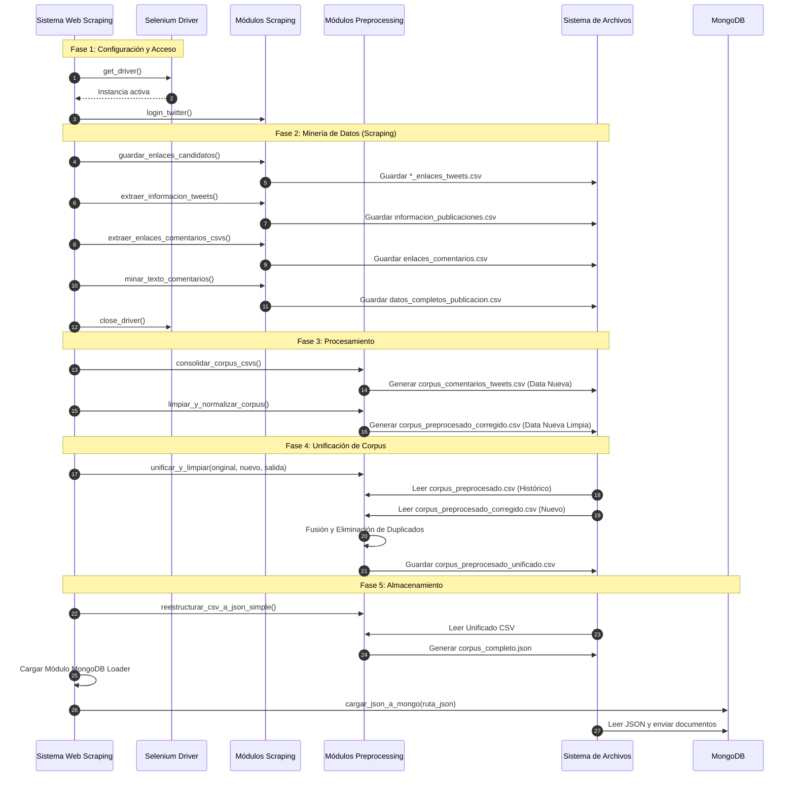

# Documentación del Flujo de Trabajo: main copy.ipynb

Este documento describe el proceso secuencial ejecutado en `main.ipynb`. A diferencia del script principal original, esta versión incluye pasos adicionales para la unificación con datos históricos y la persistencia en base de datos NoSQL (MongoDB).

## Resumen del Proceso

Este flujo de trabajo orquesta la extracción, limpieza, unificación y almacenamiento de datos sociopolíticos. Introduce una etapa crítica de **integración de datos** donde el corpus recién extraído se fusiona con un corpus "histórico" previamente existente, antes de ser transformado y cargado en la base de datos.

### Fases del Pipeline

1.  **Inicialización y Autenticación**: Configuración del driver y login en Twitter (X).
2.  **Minería de Datos (Scraping)**:
    *   Extracción de enlaces de tweets de candidatos.
    *   Extracción de metadatos de los tweets.
    *   Extracción de enlaces de comentarios.
    *   Extracción del contenido textual de los comentarios.
3.  **Procesamiento y Limpieza**:
    *   Consolidación de los CSVs extraídos en esta ejecución.
    *   Limpieza y normalización del texto.
4.  **Unificación (Etapa Nueva)**: Fusión del corpus actual limpio con el corpus histórico procesado anteriormente para mantener un dataset acumulativo.
5.  **Transformación y Carga (ETL)**:
    *   Conversión del corpus unificado a formato JSON estructurado.
    *   Carga automática de datos hacia **MongoDB**.

## Diagrama de Secuencia

El siguiente diagrama detalla la integración de los nuevos módulos de unificación (`Preprocessing`) y almacenamiento (`Storage`).

## Estructura de Salida de Datos

El flujo actualiza la estructura de datos en `datasets/processed`:

| Archivo | Origen | Descripción |
|---------|--------|-------------|
| `corpus_preprocesado_corregido.csv` | Limpieza | Datos limpios **solo de la ejecución actual**. |
| `corpus_preprocesado.csv` | Entrada | Datos históricos (Input para la unificación). |
| `corpus_preprocesado_unificado.csv` | Unificación | **Dataset Maestro**: Combinación de histórico + nuevo. |
| `corpus_completo.json` | Transformación | Versión JSON del dataset maestro lista para la BD. |
